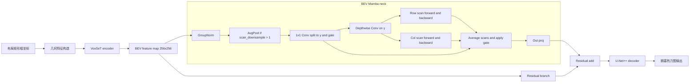
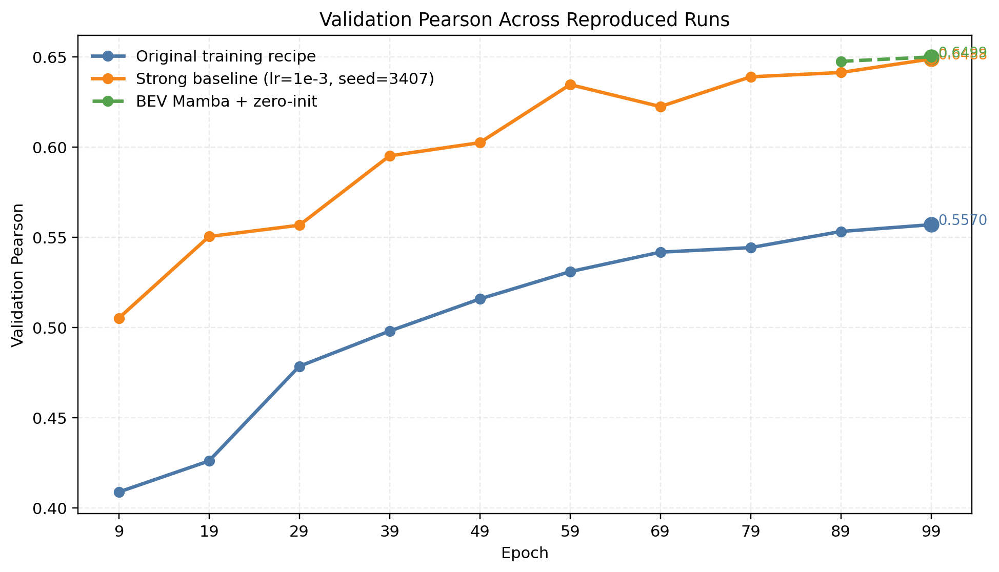
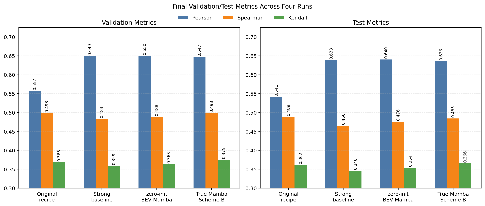
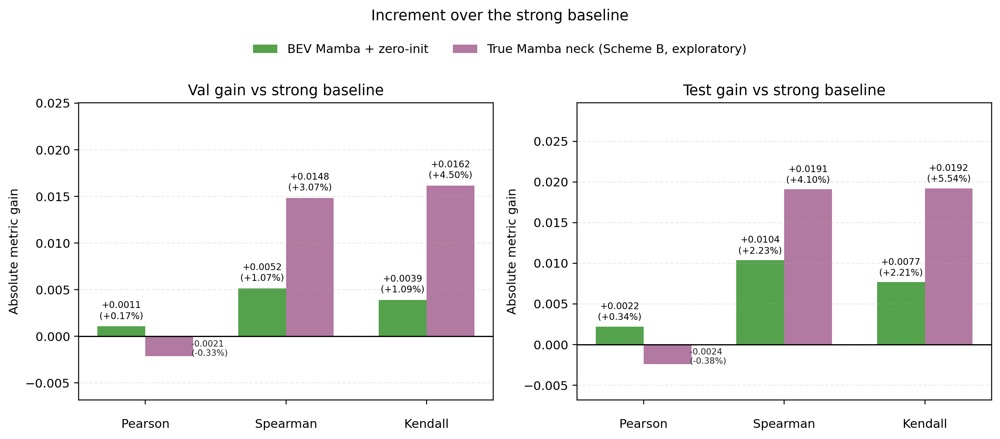
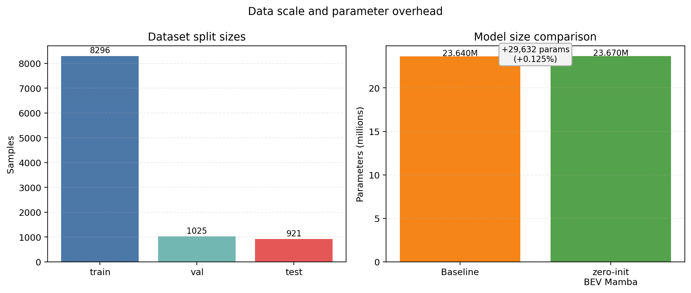
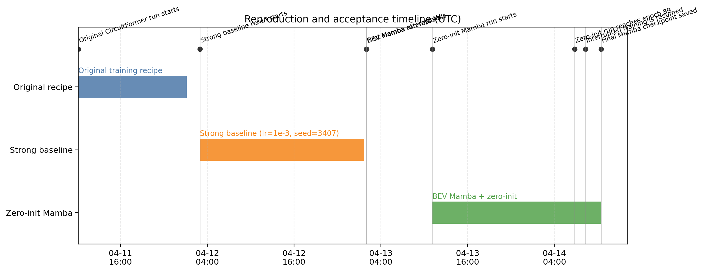
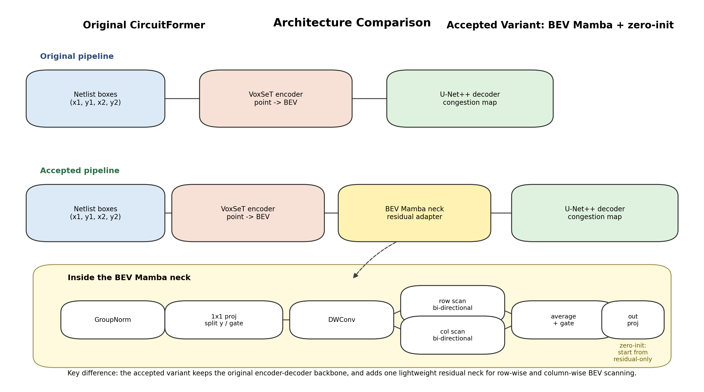

# CircuitFormer-Mamba 项目验收与收尾报告

## 0. Checklist

- 验收前置清单已先行编写并冻结，再进入正式验收。
- 最终验收采用的模型:
  - `exp/congestion_bev_mamba_zero_init_2026-04-13_19-08-30_UTC/epoch=99-pearson=0.6499.ckpt`
- 主要对比对象:
  - `exp/congestion_rerun_lr1e-3_seed3407_2026-04-12_10-58-54_UTC/epoch=99-pearson=0.6488.ckpt`
  - `exp/congestion_formal_2026-04-11_18-09-54_UTC/epoch=99-pearson=0.5570.ckpt`

## 1. 结论摘要

项目主线已经明确: 已完成 `CircuitFormer` 的可运行复现，并通过训练配方调整将强基线从 `0.5570` 提升至 `0.6488`。在此基础上，以约 `+0.125%` 的参数增量，在编码器与解码器之间加入一个受 Mamba 思想启发的轻量二维 BEV 残差 neck。最终形成的 `zero-init BEV Mamba` 版本相对强基线在验证集与测试集上均呈现小幅正增益。现有证据足以支撑项目收尾结论，结论范围限定在当前任务设置与当前单次比较证据。

### 1.1 术语说明: `zero-init BEV Mamba` 的含义

`zero-init BEV Mamba` 是当前验收版本的简称，该名称由三部分组成:

- `BEV`
  表示 *Bird's-Eye View*，即俯视平面表示。在本项目中，VoxSeT 编码器会把布局点集合整理为二维 BEV 特征图，再交给后续模块处理。

- `Mamba`
  在本项目中，`Mamba` 指向一个**受 Mamba / selective state space 思想启发**的二维轻量模块。模块位于 `model/bev_mamba.py`，作用范围集中在 encoder 与 decoder 之间的 neck 位置，其主要结构是:
  - 行扫描
  - 列扫描
  - 输入相关的状态更新
  - 门控
  - 残差连接

- `zero-init`
  表示该模块最后一层输出投影 `out_proj` 在初始化时被置零，对应代码位于 `model/bev_mamba.py`，开关为 `out_proj_init_zero=True`。

在当前项目里，`zero-init BEV Mamba` 更准确的含义可以写成:

“在 BEV 特征图上加入一个受 Mamba 思想启发的轻量残差扫描模块，并将该模块最后一层输出投影以零权重初始化。”

对应到实际配置，验收版本至少包含以下条件:

- `model.bev_mamba.enabled=True`
- `model.bev_mamba.num_blocks=1`
- `model.bev_mamba.inner_dim=64`
- `model.bev_mamba.scan_downsample=4`
- `model.bev_mamba.dw_kernel_size=3`
- `model.bev_mamba.out_proj_init_zero=True`

“轻量”在当前验收版本中可以量化为三层含义:

- 结构位置集中在 encoder 与 decoder 之间的 `1` 个 neck block，主干部分保持原有框架。
- 参数开销较小。基线总参数量为 `23,640,401`，加入 `zero-init BEV Mamba` 后为 `23,670,033`，仅新增 `29,632` 个参数，约为 `+0.125%`。
- 扫描计算在降采样后的特征图上进行。`scan_downsample=4` 表示先将 $256 \times 256$ 特征图降为 $64 \times 64$ 再扫描。若仅按扫描位置数估算，双向行列扫描共处理
  $$
  4 \times 64 \times 64 = 16,384
  $$
  个位置；若直接在 $256 \times 256$ 上执行同类扫描，则对应
  $$
  4 \times 256 \times 256 = 262,144
  $$
  个位置。当前位置设置将这一部分扫描位置数压到了原来的 $\frac{1}{16}$。

## 2. 任务定义

任务目标为**芯片拥塞热力图预测**。输入数据由标准单元或模块的矩形框坐标集合构成。模型根据这些布局元素生成 $256 \times 256$ 的拥塞分布图，用于表征潜在布线紧张区域与相对宽松区域。

项目方法的一个特点在于，流程直接采用“带几何属性的点集合”作为数据表示，并省去手工构造图像与较重图预处理步骤；模型从原始布局元素中学习特征。

## 3. 原版 CircuitFormer 的工作流程

### 3.1 输入表示

在 `model/circuitformer.py` 中，每个矩形框 $(x_1, y_1, x_2, y_2)$ 会被转换为更适合学习的几何特征:

- 中心点坐标
- 左下/右上坐标
- 宽和高
- 面积

这一表示方式同时保留了位置、尺度与形状信息。

### 3.2 编码器: VoxSeT

`model/voxelset/voxset.py` 中的 `VoxSeT` 主要包含两项关键处理:

1. 将点特征映射到隐藏空间，并叠加基于位置的傅里叶编码。
2. 在 $1\times$ / $2\times$ / $4\times$ / $8\times$ 四个尺度上执行聚合，使局部与更大范围的信息共同进入表征。

聚合后的特征会被 scatter 到 $256 \times 256$ 的 BEV 平面，后续解码器即可按照二维特征图的方式继续处理。

### 3.3 解码器: U-Net++

`model/circuitformer.py` 采用 `segmentation_models_pytorch` 中的 `UnetPlusPlus` 作为解码器，用于对整理后的二维特征图进行细化，并输出单通道拥塞图。当前实现中，解码器的 encoder 部分还会加载 `ckpts/resnet18.pth` 提供的 `resnet18` 预训练权重，因此本项目当前路线包含外部视觉预训练先验。

### 3.4 训练目标

`model/model_interface.py` 中当前验收训练主线使用的是**带像素权重的 MSE**:

- 主体误差: $(\mathrm{output}-\mathrm{label})^2$
- 再乘以数据集预先统计得到的 `weight`
- 最后乘以全局 `loss_weight=128`

`data/circuitnet.py` 中的 `weight` 来源于训练集标签分布的桶统计，并经过平滑处理。该设计使罕见但重要的拥塞区域在训练阶段获得更高关注。

需要额外说明的是，配置文件中保留了 `model.loss` 字段，当前 `training_step` 对应的正式验收训练路径为带权 MSE。报告对训练目标的表述范围据此限定在现有主线。

### 3.5 指标计算方式

`metrics.py` 对每个样本分别计算 Pearson / Spearman / Kendall，随后对样本级指标取平均。最终分数因此更接近“单张设计图平均预测质量”，较少受到少数超大样本的主导。

因此，报告中的 `test Pearson` 对应样本级相关系数均值口径，区别于将整个测试集所有像素摊平后计算单次全局相关系数。另外，当前验收配置采用单卡路径，相关说明范围限定在该执行路径。

## 4. BEV Mamba 模块原理

验收版本在 `model/circuitformer.py` 中引入了新的 `BEV Mamba neck`，结构链路为:

`VoxSeT encoder -> BEV Mamba neck -> U-Net++ decoder`

该模块位于编码器与解码器之间，输入与输出均为二维 BEV 特征图。依据现有代码，其功能可表述为: 在保持主干框架的前提下，为 BEV 特征图加入一条轻量级的行列扫描残差通道，用于补充较大范围的上下文传播。

若当前 Markdown 环境支持 Mermaid，可直接渲染以下简化流程图:

### 4.1 直观理解

VoxSeT 编码器已经能够把布局点集合整理为 $256 \times 256$ 的 BEV 特征图，但单纯依赖卷积时，远距离位置之间的信息交换通常需要较多层数逐步传递。拥塞预测任务中，某一位置的状态往往同时受局部邻域与较远区域布局密度的共同影响，因此更直接的长程传播路径具备实际意义。

`BEV Mamba neck` 的核心思路是将二维特征图拆成许多一维序列来处理:

- 沿每一行把特征图看成一条序列
- 沿每一列把特征图看成一条序列

这样做的结果是，信息可以顺着行方向与列方向连续传播。对于芯片布局这种天然具有二维空间结构的数据，这一处理方式与任务形式具有较好的对应关系。

为了降低理解门槛，可以引入三个具体类比:

- **类比 1: 城市主干道交通广播**
  一条长街上的每个路口都会上报当前车流状态。若仅观察附近几个路口，相当于卷积只看局部邻域；若把整条街按顺序扫描，则街道左端的拥堵信息可以逐步传到右端。行扫描与列扫描分别对应横向道路和纵向道路上的连续广播。

- **类比 2: 会议纪要的逐句更新**
  一段会议记录按句子顺序读入。每读到一句，纪要可以选择“主要保留前面结论”或“用当前内容重写重点”。这种“保留多少历史、写入多少当前”的机制，就是状态空间更新中 $\delta_t$ 的作用。

- **类比 3: 水渠闸门**
  扫描结果相当于已经流到当前位置的水流，门控分支相当于闸门。闸门开得大，扫描结果保留较多；闸门开得小，扫描结果被抑制。这样可以避免整张特征图被同一种强度的长程传播统一覆盖。

### 4.2 代码层面的数据流

`model/bev_mamba.py` 中的 `LightweightBEVMambaBlock` 按如下顺序处理输入特征 `x`:

1. 保存残差 `residual = x`
2. 执行 `GroupNorm`
3. 若 `scan_downsample > 1`，先做平均池化降采样
4. 经过 `1x1 conv`，将通道拆成两部分:
   - 一部分作为待扫描的内容特征 `y`
   - 一部分作为门控特征 `gate`
5. 对 `y` 执行深度可分离卷积 `dwconv`
6. 分别执行行扫描与列扫描
7. 对行扫描与列扫描结果取平均
8. 通过 `sigmoid(gate)` 对结果进行门控
9. 经 `out_proj` 投影回原始通道数
10. 若前面做过降采样，则插值恢复到原分辨率
11. 与残差执行相加，输出 `residual + y`

从结构角度看，该模块同时包含三种信息处理机制:

- `dwconv` 负责局部邻域混合
- 行列扫描负责较长距离传播
- 残差连接负责尽量保持主干表征稳定，并降低新增分支的直接改写幅度

可将这一结构理解为三层分工:

- 第一层由 `dwconv` 处理“身边发生的事情”
- 第二层由行列扫描处理“远处发生的事情”
- 第三层由残差连接保证原有主干信息持续保留

### 4.3 行扫描与列扫描的含义

行扫描与列扫描分别由 `_scan_rows` 和 `_scan_cols` 实现。

以行扫描为例，输入张量形状为 $[B, C, H, W]$。处理过程可理解为:

1. 将每一行抽出，整理为长度为 $W$ 的序列
2. 对每条序列逐步扫描
3. 再执行一次反向扫描
4. 将正向和反向结果取平均
5. 重新拼回二维特征图

列扫描过程与此完全对应，只是把“长度为 $W$ 的序列”替换为“长度为 $H$ 的序列”。

依据代码结构，可以合理预期这一设计具有如下作用:

- 行方向传播有利于聚合同一横向带状区域的信息
- 列方向传播有利于聚合同一纵向带状区域的信息
- 双向扫描可以同时利用“前文信息”和“后文信息”

对拥塞图来说，这种机制相当于允许某个网格位置同时参考左侧、右侧、上方、下方的较远区域，局部卷积核覆盖的邻域只是其中一部分依据。

若将拥塞图看成城市热力图，可以得到更直观的理解:

- 某个网格左侧连续出现高密度单元，横向扫描会逐步把这一信息带到当前位置
- 某个网格上方连续出现拥塞带，纵向扫描会把这一趋势带到当前位置
- 双向扫描意味着当前位置同时接收“从左向右”“从右向左”“从上向下”“从下向上”四个方向的上下文

因此，当前位置的判断依据会吸收更大范围的版图组织方式，邻近几个像素只是其中一部分来源。

### 4.4 状态空间更新公式

`SequenceStateSpace` 是该模块中最核心的序列更新单元。设输入序列为 `seq`，第 $t$ 个位置的更新写成公式如下:

$$
\mathrm{state}_t = (1-\delta_t)\,\mathrm{state}_{t-1} + \delta_t\,\mathrm{value}_t
$$

其中:

- $\delta_t$ 来自 `delta_proj` 后接 `sigmoid`
- $\mathrm{value}_t$ 来自 `value_proj`
- $\mathrm{state}_t$ 表示扫描到当前位置时的隐藏状态

该公式的含义可以做如下理解:

- 当 $\delta_t$ 较小，当前位置更倾向于保留之前已经累积的状态
- 当 $\delta_t$ 较大，当前位置更倾向于吸收当前输入特征

因此，$\delta_t$ 可以视为一个**自适应更新系数**。模型在每个位置都能够决定“历史信息保留多少”和“当前信息写入多少”。

与平均池化或固定卷积相比，该更新方式允许各位置、各通道采用各自的历史保留比例与当前写入比例。这一判断可以直接由 `delta_proj` 生成逐位置、逐通道 $\delta_t$ 的代码实现支持。

继续使用会议纪要的类比，可以更具体地说明这一公式:

- 若当前句子只是在重复前文，$\delta_t$ 会偏小，纪要主体继续沿用已有结论
- 若当前句子包含关键新信息，$\delta_t$ 会偏大，当前内容会更强地写入状态

再换成芯片拥塞场景:

- 若当前位置周围布局平稳，与前面区域差异较小，状态更倾向于延续此前累积的上下文
- 若当前位置突然出现高密度宏块、窄通道或明显异常模式，状态会更快吸收当前位置的信息

该机制与原论文中的“selectively propagate or forget information”在思想上相一致。

### 4.5 门控分支的作用

`in_proj` 会把输入拆成 `y` 和 `gate` 两部分。扫描结果在输出前会乘上 `sigmoid(gate)`。

该步骤可以理解为“根据当前位置特征，对扫描结果的强弱进行调节”。门控分支来自与内容分支相同的 `in_proj` 输出拆分，因此其作用是对扫描结果进行输入相关缩放。

仍可借助具体场景说明:

- 在规则、平滑的区域，闸门可能较小，避免远处信息过度干扰局部结构
- 在边界、拐角、拥塞突变区域，闸门可能较大，使长程信息更充分进入当前位置判断

### 4.6 `scan_downsample=4` 的含义

验收版本中采用 `scan_downsample=4`。输入特征图若为 $256 \times 256$，则扫描前先降为 $64 \times 64$，再在输出前上采样回原始分辨率。

从当前实现出发，这一参数设置具有两个直接效果:

- 降低扫描序列长度与计算量
- 保留较大尺度的全局结构信息

可以将其理解为“先在更粗的分辨率上建立较大范围联系，再把结果映射回原始尺度”。对于拥塞预测任务，这种做法有利于兼顾计算代价与较大范围上下文建模。

### 4.7 与原版 CircuitFormer 的关系

该模块作为中间适配层接入现有主干。原版 CircuitFormer 负责:

- 从布局点集合中提取基础几何表示
- 将表示映射到 BEV 平面
- 通过 U-Net++ 解码为拥塞图

BEV Mamba neck 的职责更集中于一项工作: 在进入解码器之前，进一步整理二维特征图中的长程依赖关系。由此形成了“原主干负责基础表征，新模块负责补充长程传播”的分工结构。

### 4.8 与 Mamba 原论文的对照

原论文为 Albert Gu 与 Tri Dao 的 *Mamba: Linear-Time Sequence Modeling with Selective State Spaces*。论文摘要给出的两项核心思想可以概括为:

1. 让状态空间模型参数成为输入的函数，并根据当前 token **选择性地传播或遗忘信息**
2. 在此基础上，设计适合高效实现的并行扫描算法

与原论文对照后，可以将本项目中的 `BEV Mamba neck` 更谨慎地定位为**受 Mamba / selective state space 思想启发的二维轻量化适配模块**。依据可分为两组:

- **一致之处**
  - 原论文强调“输入相关的选择性更新”；当前实现中，$\delta_t$ 由当前位置输入经过 `delta_proj` 得到，同样体现了输入相关更新强度
  - 原论文强调“传播或遗忘信息”；当前实现中的
    $$
    \mathrm{state}_t = (1-\delta_t)\,\mathrm{state}_{t-1} + \delta_t\,\mathrm{value}_t
    $$
    正对应“保留历史”与“写入当前”的权衡
  - 原论文将序列扫描作为核心计算路径；当前实现也以扫描为核心，只是扫描对象从一维 token 序列变为二维 BEV 特征图拆出的行序列与列序列

- **当前项目中的实现边界**
  - 当前代码显式出现 `delta_proj` 与 `value_proj` 两个线性层，输入相关参数化在代码层面的可直接对应部分集中于这一简化形式
  - `SequenceStateSpace.forward` 在时间维上使用显式 `for` 循环推进状态
  - 结构插入位置位于编码器与解码器之间的 `neck`
  - 相关思想被迁移到二维 BEV 表征，通过行扫描与列扫描处理版图空间依赖
  - 当前材料聚焦结构设计与结果表现，复杂度证明与效率 benchmark 暂未纳入收尾材料

从上述对照可以得到一个更准确的表述:

- 当前实现体现了“输入相关选择性状态更新”这一核心思想的简化形式
- 当前实现完成了面向二维拥塞图任务的结构改写
- 当前实现的结构位置为 neck 级增量模块

据此，更严格的表述可写为: 当前模块可称为 `BEV Mamba neck`，其含义限定为“**受 Mamba 原理启发、面向二维 BEV 场景设计的轻量残差扫描模块**”。这一表述与当前代码实现保持一致。

参考依据:

- 原论文: Albert Gu, Tri Dao. *Mamba: Linear-Time Sequence Modeling with Selective State Spaces*. arXiv:2312.00752. https://arxiv.org/abs/2312.00752

## 5. `zero-init` 在训练起步阶段的意义

`model/bev_mamba.py` 中提供了 `out_proj_init_zero=True` 这一设置，对应如下代码逻辑:

- 新增分支最后一层 `out_proj` 的权重被初始化为 0

在参数初始化时，由于 `out_proj` 权重被显式置零且该层 bias 为空，Mamba 分支经 `out_proj` 后输出精确为 0，整个块的输出满足:

$$
\mathrm{output} = \mathrm{residual}
$$

这意味着模块在初始化时就是恒等映射，主干网络已有表征在起始阶段保持原状。

从优化角度看，该设计具有三点直接作用:

1. 新增模块在初始化时对主干特征的直接扰动为 0
2. 梯度可以先学习“在何处介入”，再学习“介入多少”
3. 插入式结构改造有助于减小训练起步阶段的直接扰动

因此，`zero-init` 可以理解为一种“保守启动”策略。网络在初始化时先维持原始主干行为，随后再学习残差修正量。

仍可借助一个简单类比说明:

- 在一个已经运转的生产线上，新装上的辅助机械臂如果一开始就大幅改写主流程，整体系统更容易出现额外扰动
- 若机械臂初始几乎静止，只先观察、再逐步增加动作幅度，则主流程更容易保持原有状态

`zero-init` 在当前结构中发挥的正是这一类作用: 初始阶段先保持原主干行为，随后再逐渐学习有效修正。

## 6. 复现历程与阶段性分析

### 6.1 第一阶段: 原版复现跑通

最早的完整复现实验为 `exp/congestion_formal_2026-04-11_18-09-54_UTC`。该阶段证明代码、数据与训练流程整体可运行，但最终验证集 Pearson 为 `0.5570`，说明“流程可运行”与“结果达到强水平”之间仍存在明显差距。

### 6.2 第二阶段: 强基线重跑

随后采用 `lr=1e-3`、`seed=3407` 进行重跑，实验目录为 `exp/congestion_rerun_lr1e-3_seed3407_2026-04-12_10-58-54_UTC`。该阶段将验证集 Pearson 提升至 `0.6488`，表明基础训练配方本身具备较大优化空间。

该阶段的意义在于建立强基线。只有在强基线存在的前提下，后续结构改动带来的增益才能获得更清晰的归因。

### 6.3 第三阶段: Mamba 改造与首次失败记录

首次 BEV Mamba 尝试为 `exp/congestion_bev_mamba_run1_2026-04-13_09-58-40_UTC`。日志中明确记录了 `FileNotFoundError`。问题来源于数据路径指向 `../datasets/...` 下一个缺失的 `.npy` 文件。

该阶段暴露出两点工程问题:

- Hydra 运行时工作目录会变化，路径配置需要显式核对。
- 训练失败分析应优先检查输入链路与数据可达性，再讨论结构层面的有效性。

### 6.4 第四阶段: `zero-init Mamba` 收口

最终接受版本为 `exp/congestion_bev_mamba_zero_init_2026-04-13_19-08-30_UTC`。训练先运行至 `epoch 89`，保存 `epoch=89-pearson=0.6475.ckpt`；中途发生中断后，从 `last.ckpt` 恢复，最终补齐至 `epoch 99`，生成 `epoch=99-pearson=0.6499.ckpt`。

该阶段表明工程流程已具备**中断恢复并保持结果连续性**的能力。同时，zero-init 实验早期标准输出的保留情况存在缺口，当前可直接核验的中间点主要包括 `epoch 89` checkpoint 与恢复后的日志结果。

## 7. 核心结果

### 7.1 最终分数总览

| 方案 | Val Pearson | Val Spearman | Val Kendall | Test Pearson | Test Spearman | Test Kendall |
| --- | ---: | ---: | ---: | ---: | ---: | ---: |
| 原版首个完整复现 | 0.5570 | 0.4984 | 0.3685 | 0.5409 | 0.4886 | 0.3615 |
| 强基线重跑 | 0.6488 | 0.4832 | 0.3591 | 0.6382 | 0.4655 | 0.3464 |
| zero-init BEV Mamba | 0.6499 | 0.4884 | 0.3630 | 0.6404 | 0.4759 | 0.3540 |

### 7.2 Mamba 带来的增益

更合适的比较对象为**使用相同 `lr=1e-3` 与 `seed=3407` 的强基线**。在这一比较设置下，主要差异集中于结构改动本身。

相较于强基线，`zero-init BEV Mamba` 的提升如下:

- 验证集 Pearson: +0.0011
- 测试集 Pearson: +0.0022
- 测试集 Spearman: +0.0104
- 测试集 Kendall: +0.0077

需要单独指出的是，本项目从 `0.5570` 到 `0.6488` 的主要跃迁发生在强基线重跑阶段，因此当前模块的贡献可表述为“在强基线上观察到的小幅正增益”。

三个测试指标均出现同步提升，其中 Spearman 与 Kendall 的增幅高于 Pearson。基于现有指标，可以给出如下推断: 新模块带来的改进既体现在绝对值接近程度上，也体现在拥塞图高低关系的排序一致性上。该解释属于依据现有数据进行的推断，与现有结果相符；当前材料尚未给出多 seed 方差，相关结论范围据此限定在当前单次比较结果。

### 7.3 参数开销分析

参数开销较小。

基线总参数量为 `23,640,401`，`zero-init Mamba` 为 `23,670,033`。新增参数量为 `29,632`，约 `+0.125%`。

这 `29,632` 个参数全部来自当前验收配置中的单个 `LightweightBEVMambaBlock`。按照现有代码可拆解为:

- `GroupNorm(1, 64)`: `128`
- `in_proj` (`64 -> 128` 的 `1x1 conv`): `8,192`
- `dwconv` (`64` 通道深度卷积, `3x3`): `576`
- `row_scan`: `8,320`
- `col_scan`: `8,320`
- `out_proj` (`64 -> 64` 的 `1x1 conv`): `4,096`

上述各项相加满足:

$$
128 + 8,192 + 576 + 8,320 + 8,320 + 4,096 = 29,632
$$

因此，此处“轻量”对应一个可量化事实: 以一个两万九千级别参数的小型中间模块，对一个两千三百六十万级别的主模型做增量增强。

这一结果表明，当前观察到的小幅增益与大幅模型扩容无关。

## 8. 图表

### 8.1 验证集 Pearson 曲线

该图主要展示两点:

- 原版首个复现到强基线之间存在明显跃迁，说明训练配方调整具有重要影响。
- 在强基线已处于较高水平的条件下，`zero-init BEV Mamba` 仍有小幅抬升最终点位。

### 8.2 最终验证/测试指标柱状图

该图用于展示最终模型优劣关系。验收版本在验证集与测试集两个层面均保持领先。

### 8.3 相对强基线的净增益

该图突出结构改造的净贡献。重点在于，在较强 baseline 上仍能观察到小幅正增益。

### 8.4 数据规模与参数开销

该图支撑两项结论:

- 数据规模足以支撑当前项目收尾所需的结果汇总。
- Mamba 改造并未依赖大幅扩容模型规模。

### 8.5 复现与验收时间线

该图将“原版复现 -> 强基线 -> 首次 Mamba 失败 -> zero-init Mamba -> 中断恢复 -> 最终 checkpoint”串联为完整工程时间线，适合纳入项目总结。

### 8.6 结构示意图

该图适合用于配合结构介绍:

- 上半部分对应原版 CircuitFormer
- 下半部分对应验收版本
- 关键改动位于 encoder 与 decoder 之间的轻量残差 neck

## 9. 核心创新点

核心创新可归纳为以下几点:

1. **保持主干框架，仅对 BEV 特征图做增量改造。**
   该方式相较于整体重构更稳，也更利于隔离结构改动的实际贡献。

2. **用行扫描和列扫描补强二维布局特征。**
   对芯片布局这一天然二维空间任务，该设计具有较好的问题匹配性。

3. **用 zero-init 控制新模块的早期扰动。**
   该设计使新增分支以残差修正项的形式逐步介入，以减小训练起步阶段的直接改写幅度。

4. **在强基线上观察到小幅正收益。**
   该结果比仅与弱基线比较更有解释价值，但当前材料尚未给出多 seed 方差。

## 10. 事实说明

为保证陈述可核验，保留如下事实说明:

- `zero-init` 首轮训练的早期标准输出未完整保留为标准 `train.log`，因此 `epoch 89` 之前的中间验证点与另外两条实验相比缺少同粒度的完整可视化。报告中关于该实验的最终结论使用**已保存 checkpoint、恢复日志与重新跑出的测试日志**作为依据，未引入猜测性补点。
- 当前公开结论对应 congestion prediction 路线。配置文件中保留了 DRC label 路径入口；当前样本权重来源于 congestion 统计，因此 DRC 相关表述范围限定在代码入口说明。
- 当前训练主线使用的是带像素权重的 MSE。配置中保留了 `model.loss` 字段，正式表述范围限定在现有训练主线。
- 当前解码器的 encoder 部分加载了 `resnet18` 预训练权重，因此本报告将该路线视为包含外部视觉预训练先验。
- 当前 `BEV Mamba` 相对强基线的结论基于单次强基线与单次 zero-init run，对应“观察到的小幅正增益”；结论范围限定在当前单次比较证据。

## 11. 结项判断

从当前证据看，项目已经具备较完整的收尾条件:

- 原版模型已经复现
- 强基线已经建立
- Mamba 改造已经落地到代码与真实 checkpoint
- 中断恢复链路已经验证
- 最终验收模型在验证集与测试集上相对强基线均观察到小幅正增益
- 该增益未依赖大幅加参数

建议将 `zero-init BEV Mamba` 版本作为正式收口版本，并据此完成最终答辩与汇报材料。更严格的学术性主张仍需额外的多 seed 与范围校验材料支撑。
