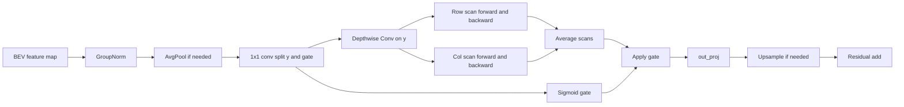

# CircuitFormer-Mamba 项目记录与结果报告

## 0. Checklist

- 前置 checklist 已冻结，实验推进与文档整理均据此执行。
- 四条已归档实验线:
  - `exp/congestion_formal_2026-04-11_18-09-54_UTC/epoch=99-pearson=0.5570.ckpt`
  - `exp/congestion_rerun_lr1e-3_seed3407_2026-04-12_10-58-54_UTC/epoch=99-pearson=0.6488.ckpt`
  - `exp/congestion_bev_mamba_zero_init_2026-04-13_19-08-30_UTC/epoch=99-pearson=0.6499.ckpt`
  - `exp/congestion_true_mamba_scheme_b_2026-04-24_02-03-01_UTC/epoch=99-pearson=0.6467.ckpt`
- 当前公开对照基线:
  - `exp/congestion_rerun_lr1e-3_seed3407_2026-04-12_10-58-54_UTC/epoch=99-pearson=0.6488.ckpt`

## 1. 定位与范围

当前项目的定位可概括为: **高质量复现 + 工程修复 + 两条 Mamba 相关 neck 路线的并行探索与对照**。

当前材料支撑以下事实:

- 原版 `CircuitFormer` 训练流程已打通。
- 训练配方调整将验证集 Pearson 从 `0.5570` 提升至 `0.6488`。
- `zero-init BEV Mamba` 路线在强基线之上带来小幅上扬，参数增量约 `+0.125%`。
- `true Mamba Scheme B` 路线调用官方 `mamba_ssm.Mamba` 模块，在当前单次 run 中呈现“Pearson 接近强基线、Spearman 与 Kendall 高于强基线”的指标形态。

公开结论范围限定在 congestion prediction、带像素权重的 MSE 主线、单次 strong baseline、单次 `zero-init BEV Mamba`、单次 `true Mamba Scheme B`。

### 1.1 两条 Mamba 路线的名称与作用范围

- `zero-init BEV Mamba`
  - 代码位置: `model/bev_mamba.py`
  - 结构定位: encoder 与 decoder 之间的轻量二维残差 neck
  - 名称含义: `zero-init` 指 `out_proj` 以零权重初始化；`BEV Mamba` 指向受 selective state space 思路启发的行列扫描模块

- `true Mamba Scheme B`
  - 代码位置: `true_mamba_experiments/modules/true_mamba_neck.py`
  - 结构定位: 与轻量 neck 相同的插入位置
  - 名称含义: 行扫描与列扫描的核心序列混合器直接调用官方 `mamba_ssm.Mamba`

- `model/circuitformer.py` 对两条路线设置了互斥保护，同一时间只启用一个 neck 路线。

## 2. 任务定义

依据原论文 *Circuit as Set of Points* 的摘要、引言与 Method 部分，CircuitFormer 面向的是布局后快速可布线性评估。论文给出的直接任务范围包括两项:

- congestion prediction
- design rule check (DRC) violation prediction

原论文对任务形式的核心界定可概括为: 基于电路设计的点级信息，执行网格级预测。对应英文原文短语如下:

> "making grid-level predictions of the circuit based on the point-wise information"

与输入抽象相关的原文短语如下:

> "treating circuit components as point clouds"

据此，原始 CircuitFormer 的任务定义可严格表述为:

- 输入: 布局后电路元件的点级表示，重点包括几何属性，并在论文叙事中同时考虑拓扑关系
- 输出: 电路版图上的网格级预测结果
- 下游任务: congestion prediction 与 DRC violation prediction

结合当前项目的公开范围，本报告进一步限定如下:

- 当前结果围绕 congestion prediction 路线展开
- 当前代码主线从矩形框坐标出发构造几何特征，并输出 $256 \times 256$ 网格上的拥塞预测图
- 指标、图表与路线对照均围绕 congestion prediction 展开

## 3. 原版 CircuitFormer 主线

### 3.1 输入表示

在 `model/circuitformer.py` 中，每个矩形框 $(x_1, y_1, x_2, y_2)$ 会被转换为更适合学习的几何特征:

- 中心点坐标
- 左下/右上坐标
- 宽和高
- 面积

这一表示方式同时保留了位置、尺度与形状信息。

### 3.2 编码器与解码器

`model/voxelset/voxset.py` 中的 `VoxSeT` 会将点特征映射到隐藏空间，并在 $1\times$ / $2\times$ / $4\times$ / $8\times$ 四个尺度上聚合信息。聚合后的特征被 scatter 到 $256 \times 256$ 的 BEV 平面。

`model/circuitformer.py` 采用 `segmentation_models_pytorch` 中的 `UnetPlusPlus` 作为解码器，用于对二维 BEV 特征图进行细化，并输出单通道拥塞图。当前实现中，解码器 encoder 还会加载 `ckpts/resnet18.pth` 提供的 `resnet18` 预训练权重，因此当前路线包含外部视觉预训练先验。

### 3.3 训练目标

`model/model_interface.py` 的当前训练主线使用带像素权重的 MSE:

$$
\mathcal{L} = 128 \cdot w \cdot (\hat{y} - y)^2
$$

其中 $w$ 来自 `data/circuitnet.py` 中基于训练集标签分布构造的权重图。该设计使高拥塞区域在训练阶段获得更高关注。

配置文件中保留了 `model.loss` 字段，当前正式训练路径对应上述带权 MSE。

### 3.4 指标口径

`metrics.py` 对每个样本分别计算 Pearson / Spearman / Kendall，随后对样本级指标取平均。因此，报告中的 `test Pearson` 对应“逐样本相关系数均值”，与“全测试集像素摊平后计算单次全局相关系数”属于不同口径。

## 4. 两条 Mamba 相关 neck 路线

### 4.1 `zero-init BEV Mamba`

`model/bev_mamba.py` 中的轻量 neck 由 `GroupNorm`、`1x1` 通道投影、深度可分离卷积、行列双向扫描、门控与残差连接构成。核心状态更新写在 `SequenceStateSpace.forward` 中:

$$
s_t = (1 - \delta_t) \odot s_{t-1} + \delta_t \odot v_t
$$

其中

$$
\delta_t = \sigma(W_\delta x_t), \qquad v_t = W_v x_t
$$

代码层面的含义较直接:

- `delta_proj` 生成输入相关的更新系数
- `value_proj` 生成待写入状态的内容
- `for idx in range(seq.shape[1])` 显式推进时间步
- 行扫描与列扫描各自做正向、反向两次遍历，再取平均

这一实现更贴近 **Mamba-inspired lightweight scan neck** 这一表述。严格口径下，官方 `selective scan kernel` 并未出现在该文件中。

`zero-init` 的含义来自 `out_proj_init_zero=True`。在初始化时，输出投影层权重被显式置零，因此新增分支在起步阶段满足:

$$
\mathrm{output} = \mathrm{residual}
$$

该设置使主干表征在训练早期保持稳定，随后再逐步学习残差修正量。

若当前 Markdown 环境支持 Mermaid，可直接渲染以下简化流程图:

### 4.2 `true Mamba Scheme B`

`true_mamba_experiments/modules/true_mamba_neck.py` 中的 `TrueMambaBlock` 直接导入官方 `mamba_ssm.Mamba`，并将二维 BEV 特征图拆成行序列与列序列:

- 行序列形状: `[B * H, W, C]`
- 列序列形状: `[B * W, H, C]`

双向扫描的写法为:

$$
f_{\mathrm{bi}}(z) = \frac{1}{2}\left(\mathrm{Mamba}(z) + \mathrm{flip}(\mathrm{Mamba}(\mathrm{flip}(z)))\right)
$$

行、列结果再取平均:

$$
y = \frac{1}{2}\left(f_{\mathrm{row}}(x) + f_{\mathrm{col}}(x)\right)
$$

当前代码还叠加了若干工程保护:

- `torch.autocast(..., enabled=False)` 使状态空间扫描保持在 `fp32`
- `_ensure_finite(...)` 在 `norm`、`downsample`、`row_scan`、`col_scan`、`out_proj`、`residual_add` 等阶段检查非有限值
- `use_mask=True` 时，仅在有效占用区域上执行扫描与回写
- `downsample > 1` 时，先缩小扫描分辨率，再插值回原尺度
- `use_residual_scale=True` 时，对新增分支额外乘一个可学习缩放系数

当前归档的 Scheme B 训练脚本位于 `true_mamba_experiments/scripts/train_congestion_true_mamba_scheme_b.sh`，核心设置为:

- `downsample=4`
- `use_input_norm=False`
- `use_mask=True`
- `mask_pool_mode=max`
- `out_proj_init_zero=False`
- `out_proj_init_std=0.001`
- `use_residual_scale=True`
- `residual_scale_init=0.001`
- `trainer.precision=bf16-mixed`
- `trainer.gradient_clip_val=1.0`

### 4.3 与 Mamba 原论文的对应关系

Mamba 原论文为 *Mamba: Linear-Time Sequence Modeling with Selective State Spaces*，论文链接为 <https://arxiv.org/abs/2312.00752>。标题中的 `Selective State Spaces` 与摘要中的 “letting the SSM parameters be functions of the input” 指向输入相关的状态空间更新。

当前项目中，两条路线与原论文的对应关系可作如下区分:

- `zero-init BEV Mamba`
  - 对应关系: 保留“输入相关更新 + 序列扫描 + 残差修正”这一思路
  - 代码边界: 手写 `SequenceStateSpace` 与显式 `for` 循环推进
  - 更贴切的术语: `Mamba-inspired lightweight neck`

- `true Mamba Scheme B`
  - 对应关系: 行扫描与列扫描的核心混合器直接调用官方 `mamba_ssm.Mamba`
  - 代码边界: 官方 selective SSM 核心来自上游库；二维展开、双向平均、mask、下采样、上采样、残差拼接属于项目侧封装
  - 更贴切的术语: `official-Mamba neck route`

## 5. 复现与工程记录

### 5.1 原版复现跑通

最早的完整复现实验为 `exp/congestion_formal_2026-04-11_18-09-54_UTC`。该阶段验证了代码、数据与训练流程整体可运行，最终验证集 Pearson 为 `0.5570`。

### 5.2 强基线重跑

随后采用 `lr=1e-3`、`seed=3407` 进行重跑，实验目录为 `exp/congestion_rerun_lr1e-3_seed3407_2026-04-12_10-58-54_UTC`。该阶段将验证集 Pearson 提升至 `0.6488`。从 `0.5570` 到 `0.6488` 的主要跃迁发生在这一阶段。

### 5.3 `zero-init BEV Mamba` 路线

对应实验目录为 `exp/congestion_bev_mamba_zero_init_2026-04-13_19-08-30_UTC`。训练先运行至 `epoch 89`，保存 `epoch=89-pearson=0.6475.ckpt`；中途发生中断后，从 `last.ckpt` 恢复，最终补齐至 `epoch 99`，生成 `epoch=99-pearson=0.6499.ckpt`。

该阶段确认了两件事:

- 轻量 neck 可以与强基线主线稳定接线
- 中断恢复链路可以保持结果连续性

### 5.4 `true Mamba Scheme B` 路线

true Mamba 路线先完成独立环境验证，再进入正式 run。环境验证与稳定性修复过程中记录到的关键信号如下:

- 官方 `mamba-ssm` 与 `causal-conv1d` 已在 `circuitformer-true-mamba` 环境下完成 CUDA 前向验证
- 宿主机环境变量曾出现 `OMP_NUM_THREADS=0`，后续脚本统一显式设为 `1`
- `metrics.py` 中 `np.float` 的兼容性要求推动 `numpy` 固定为 `1.23.5`
- `pytorch-lightning 2.1.0` 的导入路径仍会访问 `pkg_resources`，独立环境据此固定 `setuptools==75.8.0`
- `fp16-mixed` 路线曾出现 `loss_step=nan.0` 与非有限 `BatchNorm` 统计量，后续转入 `bf16-mixed + finite guard + gradient clip`
- 全分辨率 `downsample=1` 路线在显存与早期效果上都偏紧，Scheme B 改用 `downsample=4 + occupancy mask`

最终归档实验目录为 `exp/congestion_true_mamba_scheme_b_2026-04-24_02-03-01_UTC`，并已补齐 `acceptance_test_epoch99.log`。

## 6. 核心结果

### 6.1 最终分数总览

| 方案 | Val Pearson | Val Spearman | Val Kendall | Test Pearson | Test Spearman | Test Kendall |
| --- | ---: | ---: | ---: | ---: | ---: | ---: |
| 原版首个完整复现 | 0.5570 | 0.4984 | 0.3685 | 0.5409 | 0.4886 | 0.3615 |
| 强基线重跑 | 0.6488 | 0.4832 | 0.3591 | 0.6382 | 0.4655 | 0.3464 |
| zero-init BEV Mamba | 0.6499 | 0.4884 | 0.3630 | 0.6404 | 0.4759 | 0.3540 |
| true Mamba Scheme B | 0.6467 | 0.4981 | 0.3753 | 0.6358 | 0.4846 | 0.3656 |

### 6.2 相对强基线的路线对照

相对强基线，`zero-init BEV Mamba` 的变化如下:

- 验证集: Pearson +0.0011，Spearman +0.0052，Kendall +0.0039
- 测试集: Pearson +0.0022，Spearman +0.0104，Kendall +0.0077

相对强基线，`true Mamba Scheme B` 的变化如下:

- 验证集: Pearson -0.0021，Spearman +0.0148，Kendall +0.0162
- 测试集: Pearson -0.0024，Spearman +0.0191，Kendall +0.0192

从当前单次 run 的指标形态看:

- `zero-init BEV Mamba` 更接近“小幅全指标抬升”
- `true Mamba Scheme B` 更接近“Pearson 接近强基线，排序相关性提升更明显”

### 6.3 参数开销

当前统一参数统计覆盖主线基线与 `zero-init BEV Mamba` 轻量 neck 路线。

- 基线总参数量: `23,640,401`
- `zero-init BEV Mamba` 总参数量: `23,670,033`
- 新增参数量: `29,632`，约 `+0.125%`

这一结果说明，轻量路线观察到的小幅增益与大幅模型扩容无关。

## 7. 图表

### 7.1 验证集 Pearson 曲线

该图展示了四条实验线的验证终点关系:

- 原版首个复现到强基线之间存在明显跃迁
- `zero-init BEV Mamba` 终点略高于强基线
- `true Mamba Scheme B` 的终点位于强基线附近，并保持另一种指标形态

### 7.2 最终验证/测试指标柱状图

该图给出四条实验线在验证集与测试集上的最终分数。当前 true Mamba 路线的测试结果已经补入同一图中，可直接与前三条线做同口径对照。

### 7.3 相对强基线的净增益

该图将两条 Mamba 路线都放到强基线之上做净增益比较。轻量路线呈现小幅正增益，true Mamba 路线呈现“Pearson 略低、Spearman / Kendall 更高”的对照形态。

### 7.4 数据规模与参数开销

该图中的参数对照当前覆盖主线基线与 `zero-init BEV Mamba`。原因较直接: 该图服务于“轻量 neck 的参数增量”这一问题，当前参数统计范围据此限定在轻量路线。

### 7.5 结构示意图

该图对应轻量 `BEV Mamba` 路线。true Mamba 路线使用相同的插入位置，差异集中在 neck 内部的序列混合器实现。

## 8. 事实说明与当前结论

为保证陈述可核验，保留如下事实说明:

- `zero-init` 首轮训练的早期标准输出未完整保留为标准 `train.log`，`epoch 89` 之前的中间验证点当前主要依据已保存 checkpoint 与恢复日志归档。
- 当前公开结论对应 congestion prediction 路线。配置文件中保留了 DRC 入口，当前公开结果未扩展到独立 DRC 实验线。
- 当前训练主线使用带像素权重的 MSE。配置中的 `model.loss` 字段仍保留为代码接口。
- 当前解码器 encoder 部分加载了 `resnet18` 预训练权重，因此当前路线包含外部视觉预训练先验。
- 当前仓库中的两条 Mamba 路线均基于单次 run 归档，相关对照属于单次观察结果。

在这一证据范围内，当前仓库可支撑的结论如下:

- 原版 `CircuitFormer` 复现已经完成
- 强基线训练配方修复带来了本项目中最大的 Pearson 跃迁
- `zero-init BEV Mamba` 路线形成了参数开销很小、指标小幅上扬的轻量 neck 方案
- `true Mamba Scheme B` 路线形成了基于官方 `mamba_ssm.Mamba` 的可运行 neck 方案，并在排序相关性上给出了可对照结果
- 因此，`CircuitFormer-Mamba` 当前可定位为: 高质量复现、工程修复，以及两条 Mamba 相关 neck 路线的并行探索与对照
